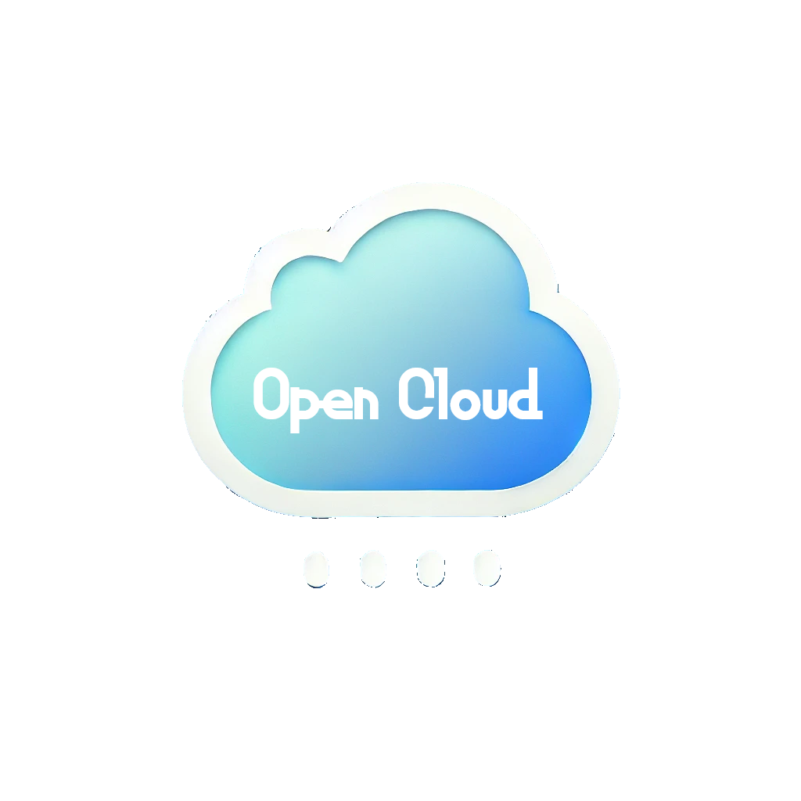
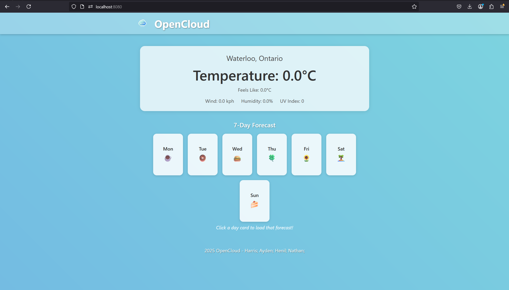

<h1 align="center">Open Cloud</h1>

<div align="center">
  <a href="https://github.com/Aiden-A-Wilson/group33_OpenCloud">
    
  </a>
</div>

<p align="center">
  <!-- Badges -->
  <a href="https://github.com/Aiden-A-Wilson/group33_OpenCloud/graphs/contributors">
    
  </a>
  <a href="https://github.com/Aiden-A-Wilson/group33_OpenCloud/network/members">
    
  </a>
  <a href="https://github.com/Aiden-A-Wilson/group33_OpenCloud/stargazers">
    
  </a>
  <a href="https://github.com/Aiden-A-Wilson/group33_OpenCloud/issues">
    
  </a>
</p>

OpenCloud is a Java-based weather web application built using Spring Boot. It allows users to view current and forecasted weather conditions for a given location, leveraging external APIs to fetch accurate data.

## Project Overview <a name="project-overview"></a>




### Key Features
- **Spring Boot Web App**:
  A lightweight, production-ready framework for running Java web services.

- **Live Weather Data**:
  Fetches real-time or forecast data from a Weather API (e.g., WeatherAPI.com).

- **Observer & Command Patterns**:
  Demonstrates classic design patterns for updating weather controllers and fetching day-specific forecasts.

- **User-Friendly UI**:
  Built with HTML/CSS/JavaScript/Thymeleaf to display weather conditions in a sleek UI.


## Technology Stack <a name="technology-stack"></a>

[](https://dev.java/)
[](https://spring.io/projects/spring-boot)
[](https://www.weatherapi.com/)


**Dependencies**:
- **Thymeleaf** – For server-side rendering of HTML pages

- **Maven** – Build and dependency management

- **Lombok (optional)** – Reduces boilerplate code

- **DevTools (optional)** – Auto-restart during development


## Getting Started <a name="getting-started"></a>

1. ### Clone the Repository 
    ```bash 
    git clone https://github.com/YourUsername/group33_OpenCloud.git
    cd group33_OpenCloud
    ```
2. ### Configure Weather API Key
   - Locate the WeatherFetcher or equivalent config where the API key is defined.
   - Insert your Weather API key (e.g., from https://www.weatherapi.com/)

3. ### Build and Run the Application
   - Maven:
    ```bash 
    mvn clean install
    mvn spring-boot:run
    ```
   - Alternatively, run via your IDE of choice.

4. ### Access the Web App
   - Go to http://localhost:8080 in your browser.
   - You should see the main weather page with “OpenCloud” branding.

## Contributors
<a href="https://github.com/Aiden-A-Wilson/group33_OpenCloud/graphs/contributors">
  
</a>

<p align="right">(<a href="#readme-top">back to top</a>)</p>


[contributors-shield]: https://img.shields.io/github/contributors/Aiden-A-Wilson/group33_OpenCloud.svg?style=for-the-badge
[contributors-url]: https://github.com/Aiden-A-Wilson/group33_OpenCloud/graphs/contributors
[forks-shield]: https://img.shields.io/github/forks/Aiden-A-Wilson/group33_OpenCloud.svg?style=for-the-badge
[forks-url]: https://github.com/Aiden-A-Wilson/group33_OpenCloud.svg/network/members
[stars-shield]: https://img.shields.io/github/stars/Aiden-A-Wilson/group33_OpenCloud.svg?style=for-the-badge
[stars-url]: https://github.com/Aiden-A-Wilson/group33_OpenCloud/stargazers
[issues-shield]: https://img.shields.io/github/issues/Aiden-A-Wilson/group33_OpenCloud.svg?style=for-the-badge
[issues-url]: https://github.com/Aiden-A-Wilson/group33_OpenCloud/issues


